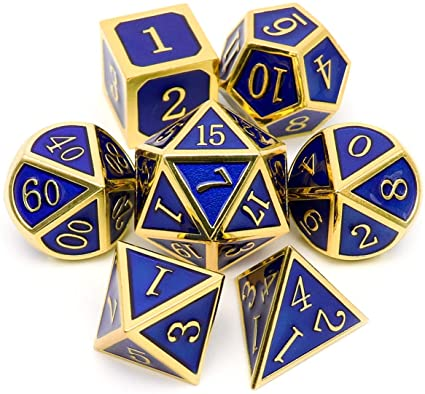

## 1.1 Точка на плоскости

Написать класс PointXY, у которого есть атрибуты x и y.

Сделать методы
а) расстояние от начала координат до этой точки

``` python
d0 = p0.distance_from_zero()
```

б) расстояние от точки до другой точки

``` python
d = p0.distance_to(p4)
```

в) Дополнить класс PointXY, чтобы можно было указывать координаты при создании


``` python
class PointXY:
    def __init__(self, ...):
        # ...

# ...

p1 = PointXY(3, 4)
```

## 1.2 Автомобиль

Сделать класс Car
c1 = Car()

а) У машины должны быть атрибуты
* "сколько бензина в баке"
* "вместимость бака" - сколько максимум влезаем бензина
* "расход топлива на км"

``` python
c1.gas_l = 30
c1.capacity_l = 40
c1.l_per_km = 0.1
```

б) метод "залить столько-то литров в бак"

``` python
c1.fill(5)  # залили 5 литров
```

должна учитываться вместительность бака
если пытаемся залить больше, чем вмещается, то заполняется полностью + print'ом выводится сообщение о лишних литрах

в) метод "проехать сколько-то км"

``` python
c1.ride(50)  # едем 50 км (если хватит топлива) 
```

выведет принт "проехали ... километров"
в результате поездки потратится бензин
если бензина не хватает, машина всё равно едет, пока не кончится бензин

г) добавить атрибут с пробегом, который увеличивается в результате ride

★д) сделать так, чтобы расход топлива увеличивался на 5% каждые 1000км.
*Здесь можно либо увеличивать пробег скачкообразно каждые 1000км, можно увеличивать более плавно каждый км, а можно вспомнить школьные интегралы.*


## 1.3 Прямоугольник по двум сторонам
Создать класс прямоугольник:

а) при создании указывается ширина и длина

``` python
r1 = Rect(10, 56)
```

б) методы для площади и периметра

``` python
print(r1.area())  # возвращает площадь
print(r1.perimeter())  # периметр
```

в) масштабирование и поворот

``` python
r1.scale(10) - высота и ширина увеличиваются в 10 раз
r1.scale(0.1) - высота и ширина уменьшаются в 10 раз
r1.rotate() - меняется ширина и высота местами
```

### Дополнительные задания на полиморфизм и magic methods:

г) ```__repr__()``` - отобразить в виде текста

д) ```~r1 (__invert__())``` - длина станет шириной и наоборот; результат операций - новый прямоугольник.

е) ```r1 * 5 (__mul__(), __rmul__())``` - обе стороны станут в 5 раз больше

ё) ```r1 / 5 (__truediv__())``` - обе стороны станут в 5 раз меньше

ж) ```r1 < r2, r1 == r2, r1 <= r1``` и т.п.

[Шесть методов для сравнения:](https://docs.python.org/3/reference/datamodel.html#object.__lt__) ```__lt__(), __gt__(), __le__(), __ge__(), __eq__(), __ne__()```


``` python
def __gt__(self, other):
	# ...
	# return True/False
```

## 1.4 Прямоугольник по двум точкам
На основе предыдущих двух задач (PointXY и Rect) сделать прямоугольник, у которого задаются координаты вершин. Стороны при этом всегда параллельны осям координат, то есть для задания достаточно двух точек (вершин).

а) при создании указываются две любые вершины типа PointXY

``` python
p1 = PointXY(1,2)
p2 = PointXY(5,6)
r2 = Rect(p1, p2)
print(r2.area())
```

(Методы rotate и scale можно не делать)

б) то же самое, но внутри хранить именно нижний левый и верхний правый углы

в) сделать метод, которым можно проверить, лежит ли точка внутри прямоугольника

``` python
print(r1.has_inside(p3)) 
```

г) аналогично пункту в) сделать зеркальный метод у класса PointXY: теперь спрашиваем у точки, лежит ли она внутри указанного прямоугольника

``` python
p1.is_inside(r1)  # находится ли p1 внутри r1
```

## 1.5 Игральные кубики

1. Написать класс Dice - игральный кубик (6 граней, от 1 до 6)
а) ```d1 = Dice()``` - конструктор по умолчанию
б) Сделать метод throw()  -вернёт число от 1 до 6

``` python
d1 = Dice()
d2 = Dice()
for i in range(10):
	score = d1.throw() + d2.throw()
	print(score)
```
<details><summary>Подсказка про random</summary>
можно использовать randrange(1, 7) из модуля random, либо choice() из того же модуля
</details>

б) Сделать метод ```show_stats()```, который показывает статистику по каждому кубиков (сколько раз какая грань выпала за историю его существования). Каким образом хранить, обновлять и отображать данные, выберите самостоятельно.

в) то же, что и в пункте б), но с общей статистикой по всем кубикам.

г) сделать так, чтобы можно было создавать не только стандартный 6-гранный кубик, но и любой другой; статистику можно хранить как в пункте б)



``` python
d1 = Dice()  # обычный кубик
d2 = Dice({1, 2, 3, 4})
d3 = Dice(range(0, 91, 10))
```


# 2. Наследование

## 2.1 Квадрат
сделать класс Square - квадрат, который наследуется от пр-ка

``` python
class Square(Rect):
    def __init__(self, size):
        # ...

    # больше никаких методов писать не нужно
    
sq = Square(5)  # Квадрат 5x5
print(sq.area())
print(sq.perimeter())
```

## 2.2 Телевизор
Сделать класс Display, унаследованный от Rect из задачи 1.2 ("Прямоугольник по двум сторонам")
а) В конструкторе указывается диагоняль в дюймах, ширина и высота в пикселях
``` python
samsung_mon = Display(19, 1920, 1080)  # 19", 1920x1080 пикселей
```

б) Должны вычисляться площадь и периметр (в дюймах или метрах - как хотите). А ещё монитор может поворачиваться на 90 градусов. Методы должны достаться от прямоугольника.

``` python
samsung_mon.area() # площадь в кв. дюймах, либо в кв. м
samsung_mon.perimeter()
samsung_mon.rotate()
```

в) Монитор должен сообщать количество точек на дюйм и количество пикселей на экране

``` python
samsung_mon.get_dpi()  # количество точек на дюйм
samsung_mon.get_pixel_num()  # сколько мегапикселей у экрана
print(samsung_mon.get_resolution_px())  # разрешение в пикселях в виде кортежа: (1920, 1080)
```

## 2.3 Список покупок
Сделать класс ShoppingList(). Он будет почти таким же, как и словарь, но его можно будет умножать на число и складывать с другим таким же объектом:

``` python
soup = {'onion': 1, 'potato': 2, 'water': 2.5, 'meat': 0.5}
salad = {'potato': 2, 'meat': 0.3, 'mayonaise': 0.1, 'peas': 200}
soup + 2 * salad  # словари так не умеют :(
```

Реализовать методы ```__add__()```, ```__mul__()```, ```__rmul__()```, ```__repr__()```.

``` python
soup_sl = ShoppingList({'onion': 1, 'potato': 2, 'water': 2.5, 'meat': 0.5})
salad_sl = ShoppingList({'potato: 2', 'meat': 0.3, 'mayonaise': 0.1, 'peas': 200})
shopping = soup_sl + salad_sl * 2
print(shopping)
```

Класс можно реализовать как с помощью композиции:

``` python
class ShoppingList:
	def __init__(self, d):
		self.ingredients = d
        # ...
```

так и с помощью наследования от словаря:

``` python
class ShoppingList(dict):
	def __init__(self, d):
        # ...
```

Дополнительно (по желанию):

1. Дополнить класс "прямоугольник" двумя методами:
r1, r2 - объекты Rect
а) r1.is_larger_than(r2) - фактически "r1 > r2" True, если площадь r1 больше площади r2
б) r1.is_equal(r2) - равны ли пр-ки - если равны их стороны
True/False

2. Дополнить класс PointXY методами:
а) __eq__, __ne__ - сравнение == != - на основе совпадения координат
б) __invert__(self), __neg__(self)
p5 = ~p1
p6 = -p2
координаты уножатся на -1 и там, и там
вернуть нужно новую PointXY
в) __abs__(self) -> float - модуль - длина отрезка между началом координат и этой точкой
г) __add__(self, other) -> PointXY
p3 = p1 + p2 - сумма иксов и игреков
д) __mul__(self, other) -> PointXY - умножить точку на число - просто умножаются координаты на это число и получается новая точка
https://docs.python.org/3/reference/datamodel.html

## 2.4 Итерабельное целое число

2. Написать класс SuperInt
* по возможности сделать через арифметику, а не строки

``` python
class SuperInt(int):
	# ...

x = SuperInt(5687654)
```

а) спрашивать длину числа
https://docs.python.org/3/reference/datamodel.html#object.__len__

``` python
print(len(x)) # 7
```

б) спрашивать, есть ли цифра в числе
https://docs.python.org/3/reference/datamodel.html#object.__contains__

``` python
print(2 in x) # False
print(5 in x) # True

```

в) спросить цифру по номеру разряда (считаем с младшего разряда)

``` python
x = SuperInt(5687654)
print(x[0]) # 4
print(x[6]) # 5
print(x[-1]) # 5
```

## 2.5 Список в стиле numpy
Дополнить список list таким образом, чтобы можно было передавать список индексов в качестве индекса

а) a = [12, 34, 354, 56, 23] # SuperList
print(a[[0, -1, 1]]) # [0, 23, 34] # list

б) a > 40
[False, False, True, ...]

в) индекс T/F как маска

a[[False, False, True, ...]]

## 2.6 Словарь для временнЫх данных


4. Сделать словарь, в котором ключ - это дата
d = DateDict()

d['25.03.2021'] = 354
d['26 mar 2021'] = 548
d['2021-03-27'] = 456

print(d['2021-03-26']) # 548

а) модуль datetime

py -3 -m pip install python-dateutil

from dateutil import parser
d = '2021-03-26' # str
d2 = parser.parse(d).date() # datetime.date

def __getitem__(self, key):
	if type(str) is str:
		key_dt = parser.parse(key).date() # 
		super().__setitem__(self, key_dt)

## 2.7 Римские цифры

Сделать класс Roman, которая происходит от int
а) конструктор из целых чисел
``` python
x = Roman('MMCI')
y = Roman('IX')
```

б) отображение в виде строки
``` python
print(x) # 'MMCI'
```

в) вся арифметика (+*/- и > < != ==....) - с другими римскими цифрами и int'ами
``` python
z = x + y
g = x + 10
```
Можно в результате операций получать int (проще) или Roman (посложнее)

г) конструктор из строк

``` python
x2 = Roman.from_str('MMCI')
y2 = Roman.from_str('IX')
```

Подсказка 1:
удобнее рассматривать числа вида IV, IX, XV и т.п. как самотоятельные цифры наряду с I V X C ...

Подсказка 2:
<code>
d = {
	1: 'I',
	4: 'IV',
	5: 'V',
	9: 'IX',
	10: 'X',
	40: 'XL',
	50: 'L',
	90: 'XC',
	100: 'C',
	400: 'CD',
	500: 'D',
	900: 'CM',
	1000: 'M'
}
</code>

Подсказка 3
# https://github.com/boo-learn/SpecialistPython2_v2/blob/master/Module3/practice/05_task_Ronam_numbers.py


# 3 Большая задача про колоду карт

## 3.1 Игральная карта

Сделать класс Card

а) сделать конструктор - число либо буква J/Q/K/A + название масти

``` python
c1 = Card(5, 'spades')
c2 = Card('A', 'hearts')
```

* старшинство - число от 2 до 10, либо 'J', 'Q', 'K', 'A'
* масть - название масти строкой

Символ |  Код
------:|--------
   ♠   |'/u2660'
   ♣   |'/u2663'
   ♥   |'/u2665'
   ♦   |'/u2666'

б) сделать repr

* с1 -> '5♠'
* c2 -> 'A♥'

в) операции сравнения карт, правила будут такие
у мастей есть старшинство 
♠<♣<♦<♥
если у карт разные масти, то сравниваются на основе мастей
если масти одинаковые, то смотрим на старшинство, туз самый старший, 2 самая младшая


<details><summary>В помощь, если не хочется писать руками много словарей</summary>

``` python

valid_values = {2, 3, 4, 5, 6, 7, 8, 9, 10, 'J', 'Q', 'K', 'A'}

weights = {
    2: 101,
    3: 102,
    4: 103,
    5: 104,
    6: 105,
    7: 106,
    8: 107,
    9: 108,
    10: 109,
    'J': 110,
    'Q': 111,
    'K': 112,
    'A': 113
    }

valid_values = {'hearts', 'spades', 'clubs', 'diamonds'}

weights = { # ♠<♦<♣<♥
    'hearts': 1,
    'clubs': 2,
    'diamonds': 3,
    'spades': 4,
}

symbols = {
    'hearts': '\u2665',
    'clubs': '\u2663',
    'diamonds': '\u2666',
    'spades': '\u2660',
}

```

</details>

г) Написать функцию или метод, которая генерирует случайную карту

``` python
c = Card.random()
print(c)
```

д) Написать функцию (не метод) ```generate_deck()``` - не принимает аргументов, возвращает список list из 52 карт, отсортированных

``` python
deck = Card.generate_deck()
for card in deck:
    print(card)
```

## 3.2 Колода карт
Написать класс Deck, который будет отвечать за создание и работу колоды карт. Должен выполняться следующий код:

``` python 
# Создали колоду, уже отсортированная, 52 карты
d = Deck()

# Перемешали
d.shuffle()

# Достали 5 карт
hand = d.draw(5)
print(hand)
``` 

а) Реализовать с помощью композиции: внутри класса Deck лежит список list карт типа card, Deck ни от чего не наследуется.

б) Реализовать с помощью наследования: класс Deck сам является подклассом списка list, в нём же лежат карты card.

Совет: в этой задаче удобно класс Card и все вспомогательные классы и функции можно положить в отдельный файл (например, cards.py) и подключать как модуль, т.к. в них мы изменения вносить уже не будем:

``` python
from cards import Card, Rank, Suit

class Deck: # композиция
    def __init__(self):
    # ...
```

## 3.2 Карточная игра
Написать на основе этой колоды класс Game, который будет отвечать за игру в блэк джек пользователя с крупье (компьютером).

# 4. Большая задача про базу данных автомобилей
Создать класс для базы автомобилей

auto.json, auto_small.json

а) загрузить данные из файла

б) Сделать клас Car, который конструируется из словаря dict вида

``` python
{
    "kmage": 72500,
    "model": "Porsche 911",
    "generation": "VI (997) Carrera S",
    ....
    "power": 355,
    "fuel": "Бензин"
}
```

в) Сделать класс Selection, в котором лежит список list автомобилей (класс Car)

г) Сделать метод - фильтр. Возвращает объект типа selection, но с другим набором авто.

``` python
selection.filter({'kmage': (50000, 100000), 'year': '2018'})
```


д)
Сделать сортировку в Selection по указанному в виде строки признаку. Результат - объект типа selection, но отсортированный как надо.

``` python
cars4 = cars1.sort_by('year')
sorted(cars2.records, key = lambda car: car.price)
sorted(cars2.records, key = lambda car: getattr(car, 'price'))
sorted(cars2.records, key = lambda car: getattr(car, by))
```

https://docs.python.org/3/library/functions.html#sorted


е) Сделать ф-ию get_unique(), которая вернёт множество уникальных значений в выборке по указанному полю
res = set() 
